# CUELiveDemoSPM

Here are the instructions how to add CUELive SDK SPM-package to your project. Follow these steps one-by-one to make your own project similar to this demo-project.

## Add the CUELive SDK

Add the CUELive framework using the Package manager in Xcode. Use the URL: `https://github.com/CUEAudio/CUELive-SPM.git`

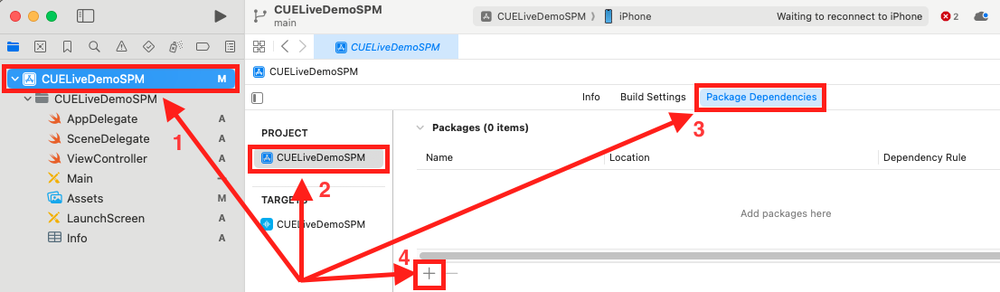

Once the dialog for the package manager is opened, search for the CUELive SPM in the search field at the top right. Enter the following URL to help discover the package: `https://github.com/CUEAudio/CUELive-SPM.git`, select version **3.5.29** or higher.

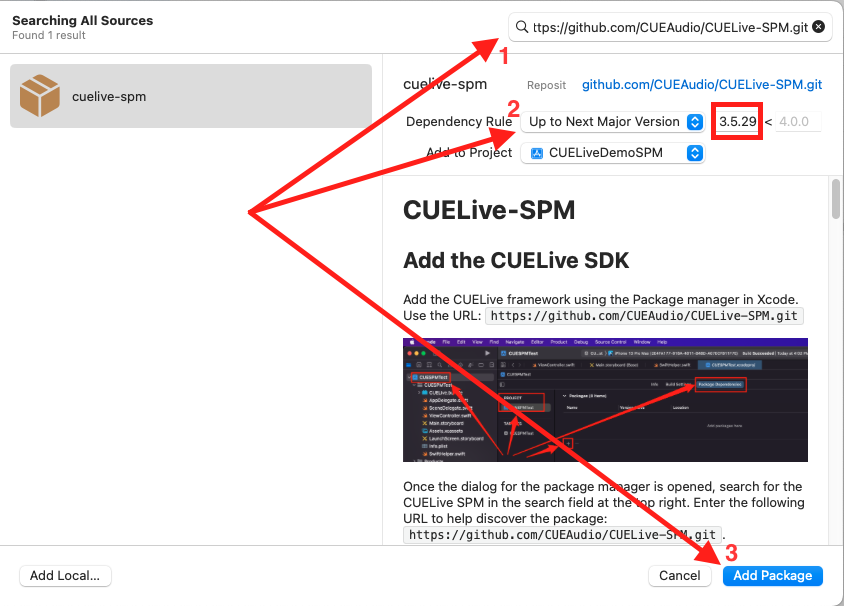

Once the package has been downloaded, press `Add Package` button.

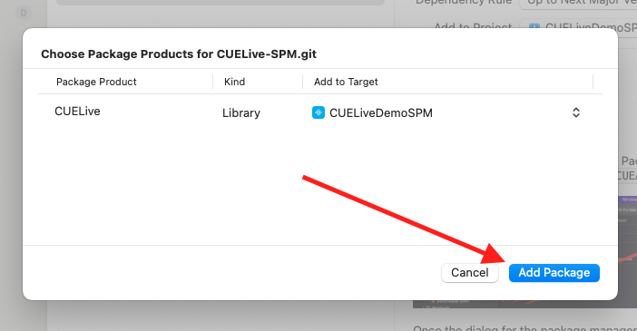

You will see the installed packages in Project Navigator in the _Package Dependencies_

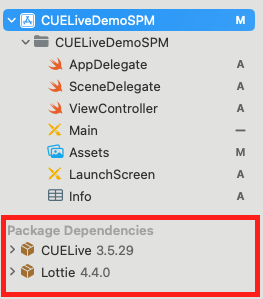


## Adding the required `.bundle`

Download the resource bundle (file with `.bundle` extension) [here](https://swift-package-manager.s3.amazonaws.com/bundles/with-lottie/CUELive.bundle.zip). Drag and drop the file into your project

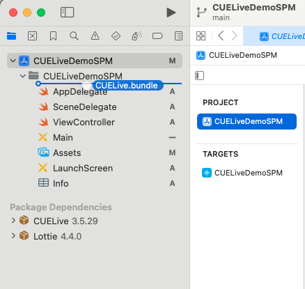

Make sure to select the `Copy items if needed` is selected. Click Finish.

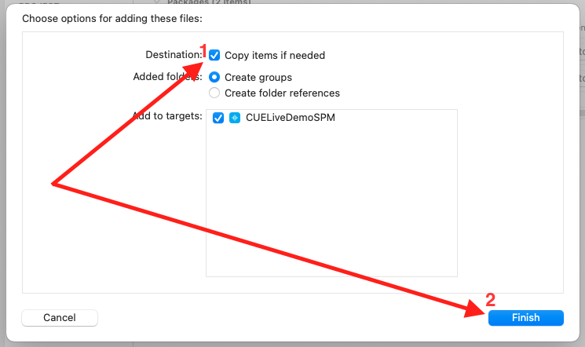

Verify that the bundle can now be seen in the Project Navigator

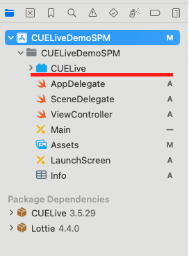

## Modifying the Build Settings

Next add the `-all_load` linker flag to the build target. Look for "Other linker flags" in the Build Settings of the target, and add the `-all_load` flag

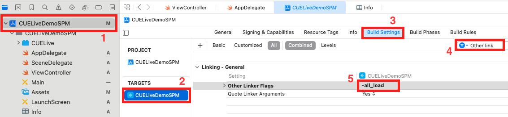

## Set up description keys for Camera/Microphone/Photo library access

Please write description texts for the following Info.plist keys:

- NSCameraUsageDescription
- NSMicrophoneUsageDescription
- NSPhotoLibraryAddUsageDescription
- NSPhotoLibraryUsageDescription

Result should be looking like that:

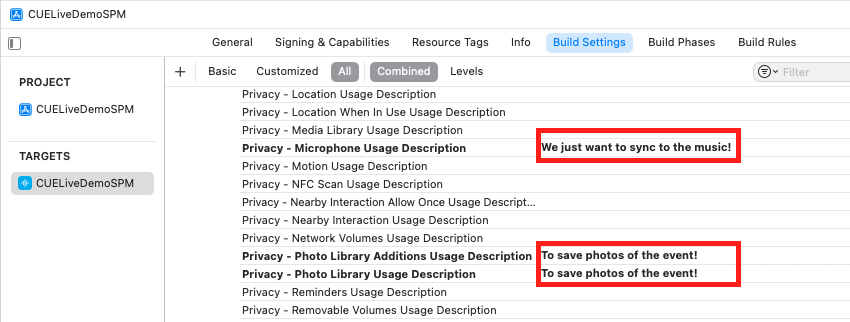

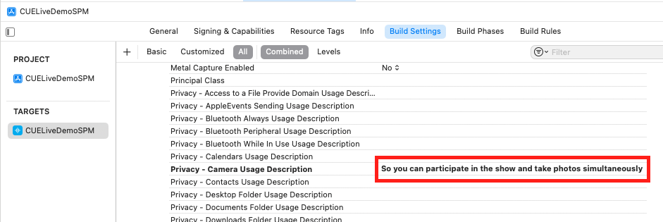

## Optional explicit usage of Lottie library

In case your project needs to use Lottie library, you can explicitly add link to it to your project

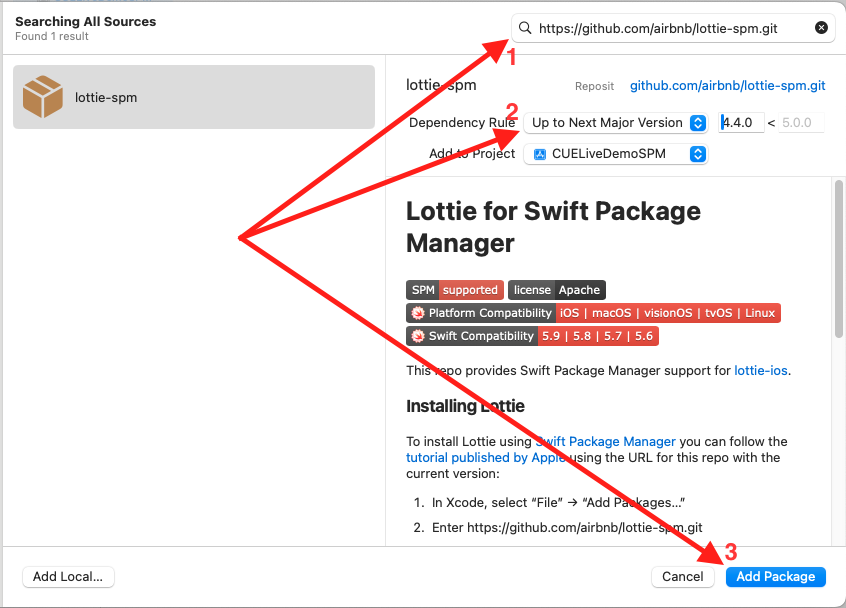 

Please keep in mind:
1. Your app should use **exactly** `lottie-spm` package, **not other** source of Lottie (e.g. lottie-ios).
2. Version of Lottie should be 4.0.0 or higher.

Finally your dependencies section should look like this:
 
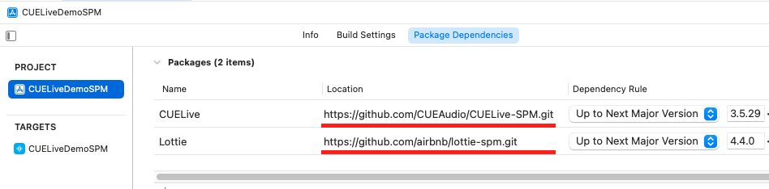

## Associated Domains

In your project settings, you should add two Associated Domains as shown here:


## How to call CUELive library from your code

First add import-directive to your code file
```swift
import CUELive
```

Then add the UIButton object with the following tap handler to start the LightShow
```swift
@IBAction func LaunchLightshowButtonPressed(_ sender: Any) {
    let initialController = NavigationManager.initialController()
    initialController.modalPresentationStyle = .fullScreen
    present(initialController, animated: true)
}
```

## Using PRIVACY flag

You can pass optional PRIVACY flag to prevent collecting and sending to the server any user information. SDK initialization in this case looks like that:

```swift
@IBAction func launchLightShowGUI(_ sender: Any) {
    let params: NSDictionary = ["PRIVACY":true]
    let initialController = NavigationManager.initialController(extraData: params)
    initialController.modalPresentationStyle = .fullScreen
    present(initialController, animated: true)
}
```
